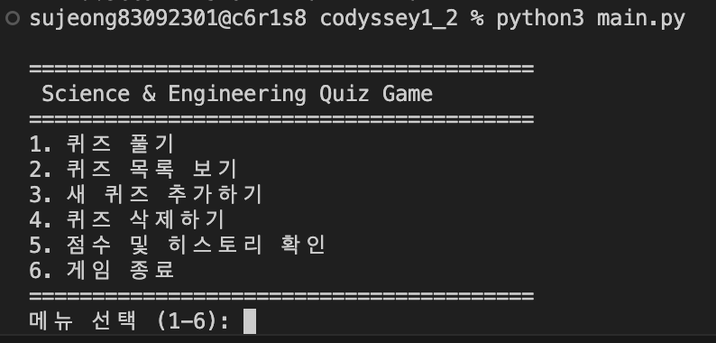
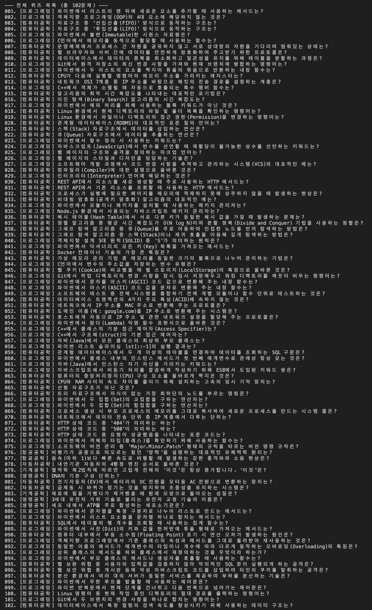
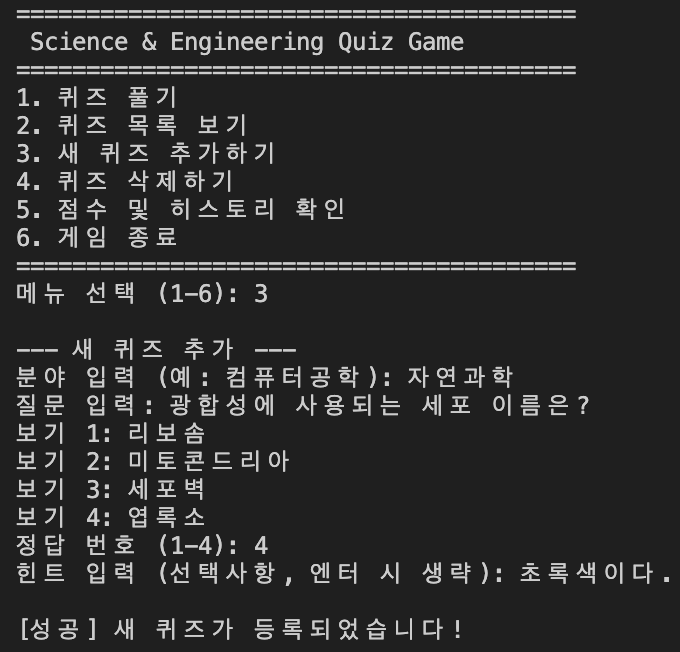
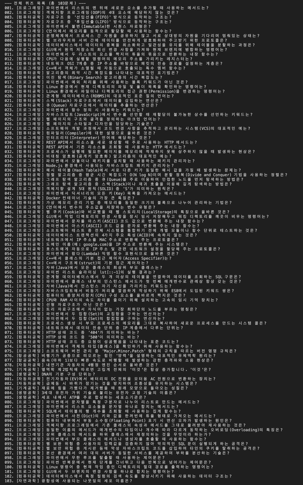
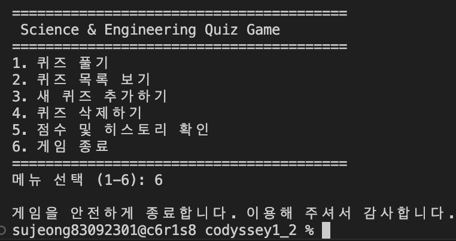
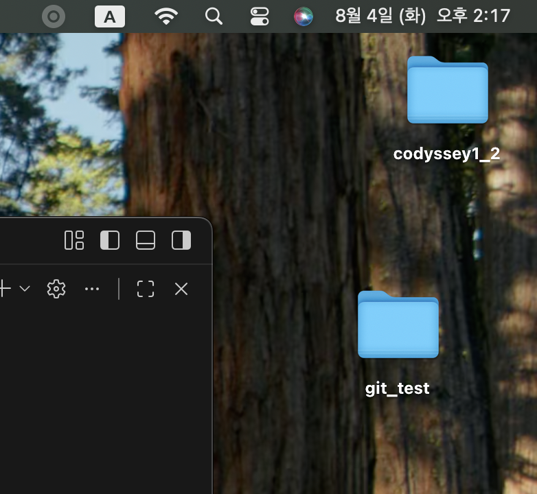

# Python Console Quiz Game

> **Python 표준 라이브러리만을 사용하여 개발한 콘솔 기반 퀴즈 게임**  
> 객체지향 프로그래밍(OOP), JSON 파일 입출력, 예외 처리, Git Workflow를 적용하여 제작한 프로젝트입니다.

---

# 프로젝트 개요 (Overview)

본 프로젝트는 **컴퓨터공학 및 다양한 전공 분야의 핵심 개념을 학습할 수 있는 콘솔 기반 퀴즈 게임**입니다.

사용자는 원하는 개수의 문제를 선택하여 무작위로 퀴즈를 풀 수 있으며, 힌트 기능, 최고 점수 기록, 플레이 히스토리 저장 등 다양한 기능을 제공합니다.

프로그램 종료 후에도 퀴즈 데이터와 최고 점수, 플레이 기록이 유지되도록 **JSON 기반 데이터 영속성(Data Persistence)** 을 구현했습니다.

---

# 프로젝트 목표
본 프로젝트를 통해 다음 내용을 직접 구현하고 학습했습니다.

- Python 객체지향 프로그래밍(OOP)
- JSON 파일 입출력(File I/O)
- 예외 처리(Exception Handling)
- Git 브랜치 기반 개발 및 병합(Merge)
- GitHub를 활용한 버전 관리

---

# 퀴즈 주제 및 선정 이유

## 주제

- 컴퓨터공학
- 프로그래밍 (Python / C / C++ / Java / JavaScript)
- 운영체제(OS)
- 네트워크
- 데이터베이스(DB)
- 소프트웨어 공학
- 기계공학
- 전자공학
- 생명공학

## 선정 이유

1. 단순한 상식 퀴즈가 아닌 **전공 학습과 기술 면접 대비**에 도움이 되는 문제를 제작하고자 했습니다.

2. **총 103개의 다양한 문제**를 수록하여 반복 플레이 시에도 새로운 문제를 경험할 수 있도록 구성했습니다.

---

# 실행 방법 (How to Run)

## 개발 환경

- Python 3.10 이상
- VS Code
- Git
- GitHub
- 표준 라이브러리(Standard Library)만 사용

## 실행

프로젝트 루트 디렉터리에서 아래 명령어를 실행합니다.

```bash
python3 main.py
```

---

# 주요 기능

## 메인 화면



---

## 기본 기능

| 기능 | 설명 |
|------|------|
| 퀴즈 풀기 | 저장된 퀴즈를 출제하고 정답을 확인 |
| 퀴즈 추가 | 새로운 문제를 직접 등록 |
| 퀴즈 삭제 | 등록된 문제 삭제 |
| 퀴즈 목록 | 저장된 전체 문제 확인 |
| 최고 점수 조회 | 최고 점수 확인 |
| 플레이 기록 조회 | 날짜와 점수 기록 확인 |

---

## 보너스 기능

| 기능 | 설명 |
|------|------|
| 랜덤 출제 | `random.sample()`을 이용한 무작위 출제 |
| 문제 수 선택 | 원하는 개수만큼 문제 선택 |
| 힌트 기능 | `h` 입력 시 힌트 제공 (점수 차감) |
| 플레이 히스토리 | 플레이 날짜와 점수를 저장 |

---

## 실행 화면

### 퀴즈 목록 및 추가

| 퀴즈 목록 | 퀴즈 추가 |
|-----------|-----------|
|  |  |

### 추가 후 목록 및 종료 화면

| 추가 후 목록 | 종료 화면 |
|--------------|-----------|
|  |  |

---

# 예외 처리 및 방어 로직

프로그램이 비정상 종료되지 않도록 다양한 예외 상황을 처리했습니다.

- 입력값 앞뒤 공백 제거 (`strip()`)
- 빈 입력 처리
- 숫자 변환 오류 (`ValueError`) 처리
- 허용 범위를 벗어난 입력 재요청
- `KeyboardInterrupt (Ctrl+C)` 처리
- `EOFError` 처리
- `state.json` 파일이 없을 경우 기본 데이터 생성
- JSON 파일 손상 시 기본 데이터로 자동 복구


---

# 클래스 구조

## Quiz

개별 퀴즈를 관리하는 클래스입니다.

### 역할

- 문제 저장
- 보기 저장
- 정답 확인
- 문제 출력

---

## QuizGame

게임 전체를 관리하는 클래스입니다.

### 역할

- 메뉴 출력
- 퀴즈 진행
- 퀴즈 추가 및 삭제
- 최고 점수 관리
- 플레이 기록 관리
- JSON 저장 및 불러오기

---

# 프로젝트 구조

```text
.
├── src/
│   ├── mainscreen.png
│   ├── quizlist.png
│   ├── quizlist2.png
│   ├── addquiz.png
│   ├── clone_test1.png
│   ├── clone_test2.png
│   ├── clone_test3.png
│   ├── clone_test4.png
│   └── clone_test5.png
│
├── constants.py      # 기본 퀴즈 데이터 및 상수
├── quiz.py           # Quiz 클래스
├── game.py           # QuizGame 클래스
├── storage.py        # JSON 저장 및 로드
├── state.json        # 데이터 저장 파일
├── main.py           # 프로그램 실행
└── README.md
```

---

# 데이터 파일 (state.json)

프로그램은 프로젝트 루트의 **state.json** 파일을 이용하여 데이터를 영구적으로 저장합니다.

## 저장 항목

- quizzes
- best_score
- history

프로그램 종료 시 자동 저장되며 실행 시 자동으로 불러옵니다.

파일이 존재하지 않거나 손상된 경우 기본 데이터로 복구하여 프로그램이 계속 실행될 수 있도록 구현했습니다.

### JSON 예시

```json
{
  "quizzes": [
    {
      "category": "프로그래밍",
      "question": "파이썬에서 리스트의 맨 뒤에 요소를 추가하는 메서드는?",
      "options": [
        "append()",
        "push()",
        "add()",
        "insert()"
      ],
      "answer": 1,
      "hint": "리스트 끝에 요소를 추가하는 메서드입니다."
    }
  ],
  "best_score": 100.0,
  "history": [
    {
      "date": "2026-08-04 14:30:00",
      "score": 100.0,
      "total_questions": 5
    }
  ]
}
```

---

# Git Workflow

기능별 브랜치를 생성하여 개발한 뒤 **Merge**를 통해 main 브랜치에 통합했습니다.

### 개발 과정

- Git 저장소 생성
- Feature Branch 생성
- 기능별 Commit
- Merge
- GitHub Push
- Clone 실습
- Pull 실습

### Clone & Pull 실습

| Clone | Pull |
|--------|------|
|  |  |

| Push | Pull 확인 |
|-------|-----------|
|  |  |

| 최종 확인 |
|-----------|
|  |

---

# 개발 환경

| 항목 | 내용 |
|------|------|
| Language | Python 3.10+ |
| IDE | Visual Studio Code |
| Version Control | Git |
| Repository | GitHub |
| Data Format | JSON |
| Libraries | Python Standard Library |

---

# 프로젝트 특징

- Python 표준 라이브러리만 사용
- 객체지향 프로그래밍(OOP) 적용
- JSON 기반 데이터 영속성 구현
- 입력 검증 및 예외 처리 구현
- Git 브랜치 기반 개발
- GitHub를 활용한 버전 관리
- 총 103개의 다양한 전공 퀴즈 제공
