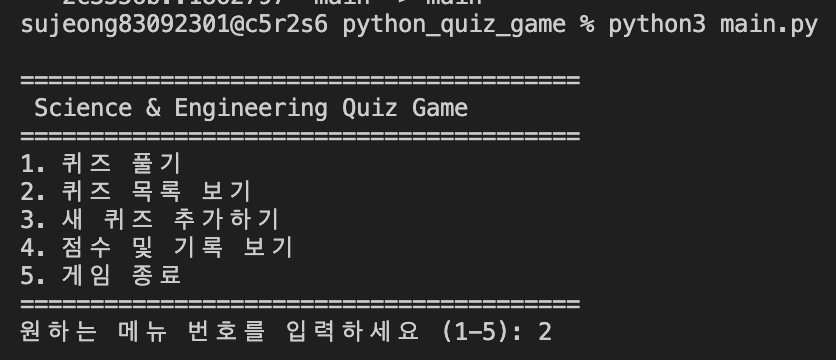
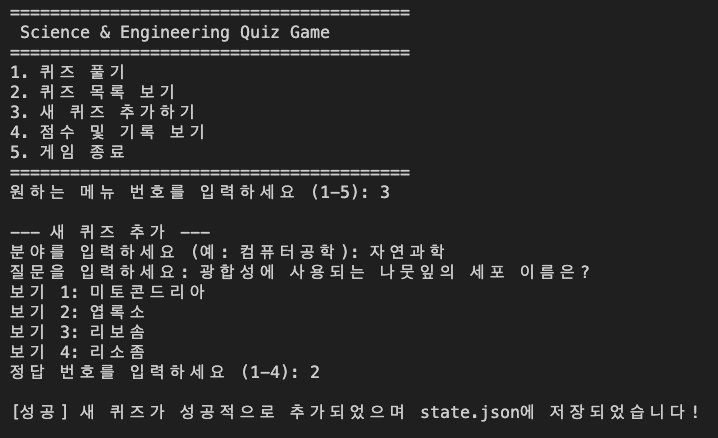
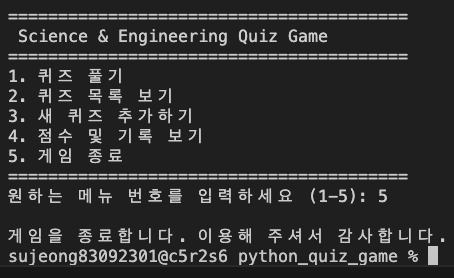
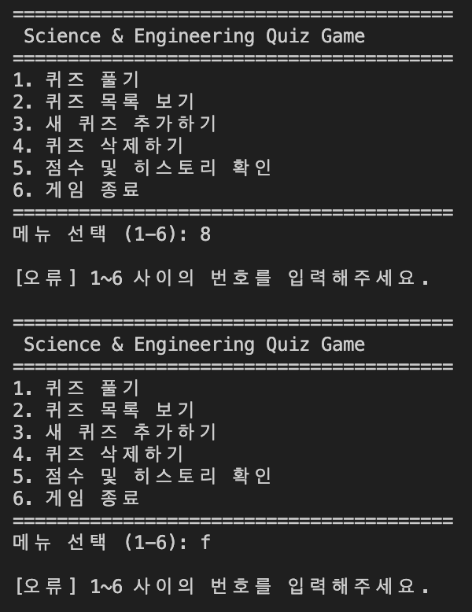
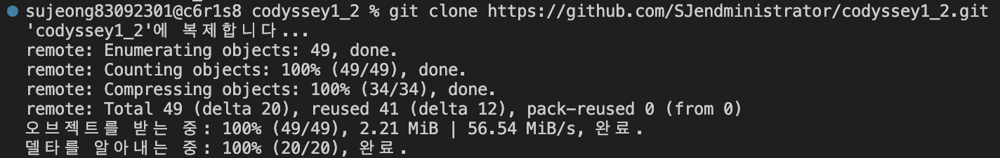
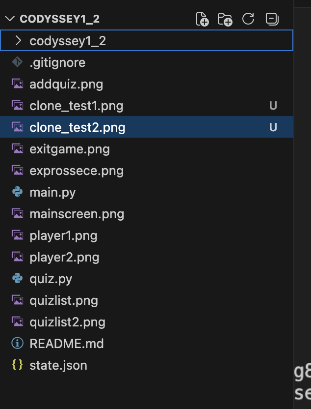
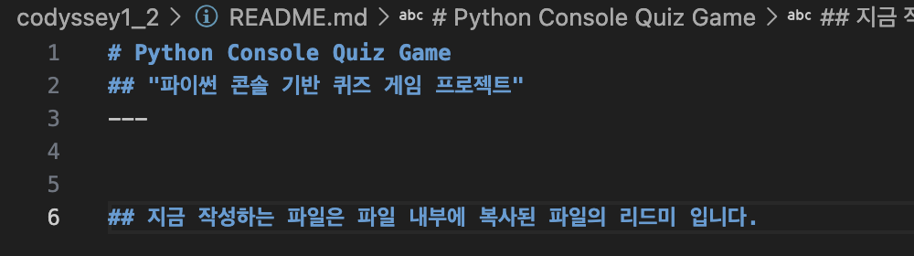
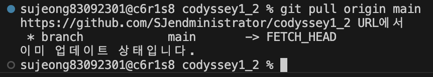

# Python Console Quiz Game
## "파이썬 콘솔 기반 퀴즈 게임 프로젝트"
---


# Python Console Quiz Game (컴퓨터공학 & 전공 지식 퀴즈)

> **콘솔 기반의 대화형 퀴즈 게임 프로젝트**  
> Python 표준 라이브러리만을 활용하여 객체지향 설계, 예외 처리, 파일 I/O 및 Git 워크플로우를 준수하여 제작되었습니다.

---

## 1. 프로젝트 개요 (Overview)
본 프로젝트는 컴퓨터공학 기초 지식 및 다양한 학문 분야의 전공 핵심 개념을 학습할 수 있는 콘솔 기반 퀴즈 프로그램입니다.  
사용자는 원하는 문제 수를 선택하여 무작위로 퀴즈를 풀 수 있으며, 힌트 기능, 최고 점수 기록, 풀이 히스토리 저장 등 다양한 기능을 제공합니다.

---

## 2. 퀴즈 주제 및 선정 이유

* **주제**: 컴퓨터공학, 프로그래밍(Python/C/C++/Java/JS), 네트워크, OS, 데이터베이스, 소프트웨어 공학 및 기계/전자/생명공학 등 종합 전공 지식
* **선정 이유**: 
  1. 단순 흥미 위주의 퀴즈를 넘어 **실제 전공 학습 및 면접 대비**에 도움이 되는 양질의 문제 데이터셋을 구축하고자 했습니다.
  2. 총 **103문항의 다채로운 문제**를 포함하여 반복적인 플레이에도 매번 새로운 문제를 접할 수 있도록 하였습니다.

---

## 3. 실행 방법 (How to Run)

### 필수 조건 (Prerequisites)
* Python 3.10 이상 (표준 라이브러리만 사용하므로 별도의 `pip` 패키지 설치 불필요)

### 실행 명령
```bash
python3 main.py

```

---

## 4. 주요 기능 목록 (Features)

### 메인 기능



* **퀴즈 풀기 (보너스 기능 포함)**
* **랜덤 출제**: `random.sample`을 이용한 문제 순서 무작위 섞기
* **문제 수 선택**: 103개 중 원하는 풀이 문항 수 지정 가능
* **힌트 시스템**: 풀이 중 `h` 입력 시 힌트 제공 (힌트 사용 시 점수 차감 방식 반영)
* **점수 계산 및 히스토리**: 풀이 완료 후 정답률 출력 및 기록 저장


* **퀴즈 목록 조회**: 저장된 전체 퀴즈 문제와 카테고리, 보기 확인
* **퀴즈 추가**: 사용자가 직접 문제, 보기 4개, 정답 번호, 힌트를 입력하여 등록
* **퀴즈 삭제**: 기존 문제 번호를 선택하여 데이터베이스에서 삭제
* **점수 및 히스토리 확인**: 역대 최고 점수 및 과거 플레이 기록(날짜/시간, 점수, 푼 문제 수) 조회







### 예외 처리 및 방어 로직 (Robustness)

* **공통 입력 검증**: 입력 앞뒤 공백 자동 제거(`strip`), 빈 입력 및 범위를 벗어난 메뉴/정답 선택 시 재입력 요청
* **타입 예외 방어**: 문자열/숫자 변환 오류(`ValueError`) 시 안내 메시지 출력 후 안전하게 복구
* **강제 종료 방지**: `Ctrl+C` (`KeyboardInterrupt`) 또는 `EOFError` 발생 시 비정상 종료 없이 안전하게 저장 후 종료
* **데이터 무결성 보장**: `state.json` 미존재 또는 파일 손상/형식 오류 시 기본 퀴즈 데이터로 자동 복구



---

## 5. 프로젝트 파일 구조 (File Structure)

```text
.
 ├── constants.py   # 상수 및 기본 데이터셋 (이미 존재)
 ├── quiz.py        # Quiz 모델 클래스 (이미 존재)
 ├── storage.py     # [NEW] 파일 저장/로드 (JSON I/O)
 ├── game.py        # [NEW] 퀴즈 진행 및 점수 계산 로직
 └── main.py        # [최종] 메인 메뉴 실행 및 단순 흐름 제어 (슬림화!)

```

---

## 6. 데이터 파일 설명 (`state.json`)

* **경로**: `./state.json` (프로젝트 루트 디렉터리)
* **역할**: 영속적 데이터 관리를 위해 퀴즈 목록, 최고 점수, 플레이 히스토리를 저장 및 로드합니다.
* **인코딩**: `UTF-8`


### JSON Schema 예시

```json
{
    "quizzes": [
        {
            "category": "프로그래밍",
            "question": "파이썬에서 리스트의 맨 뒤에 새로운 요소를 추가할 때 사용하는 메서드는?",
            "options": ["append()", "push()", "add()", "insert()"],
            "answer": 1,
            "hint": "리스트 끝에 항목을 '덧붙이다'라는 뜻의 영어 단어입니다."
        }
    ],
    "best_score": 100.0,
    "history": [
        {
            "date": "2026-08-04 14:30:00",
            "score": 100.0,
            "total_questions": 5
        }
    ]
}

```

---

## 7. Git Workflow & 실습 이력

* `main` 브랜치 외 기능별 브랜치 활용 및 병합(Merge) 진행
* `git clone` 및 `git pull`을 통한 저장소 동기화 및 원격 실습 완료





